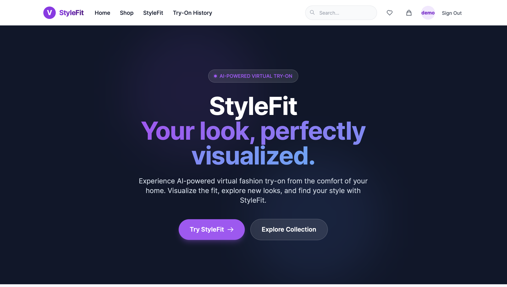
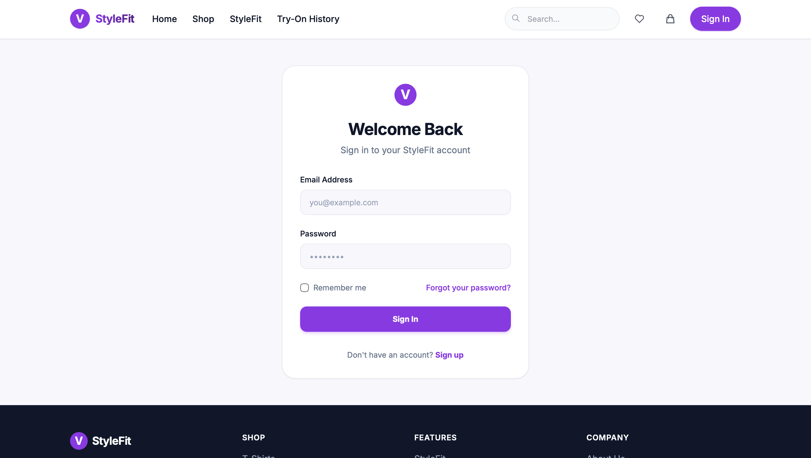
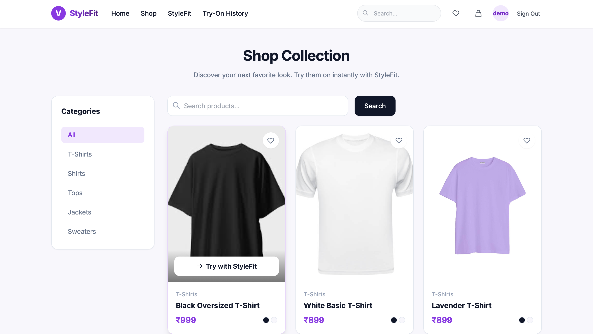
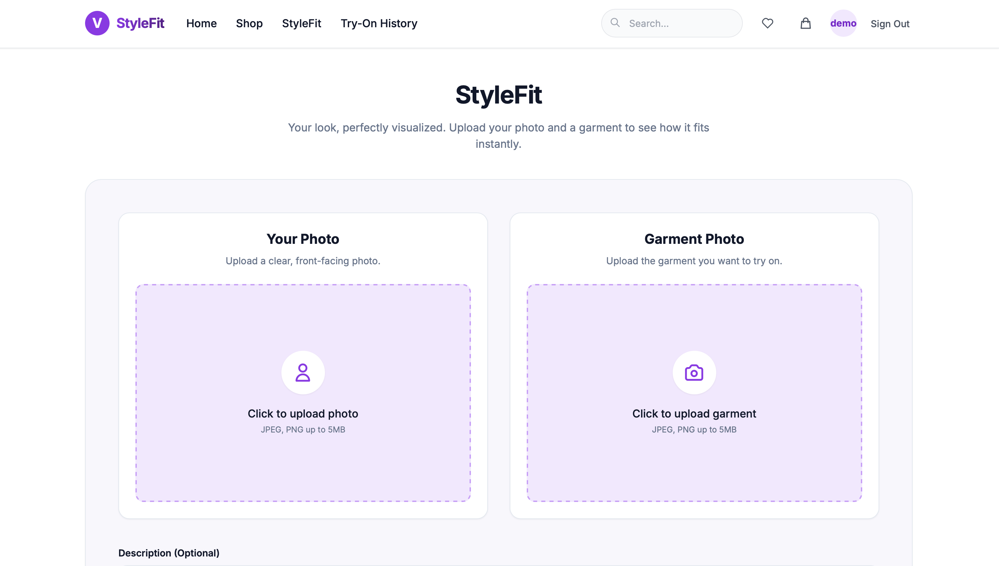
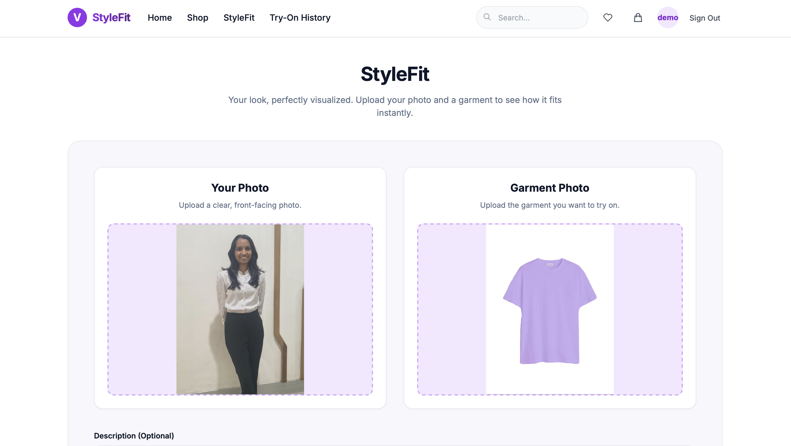
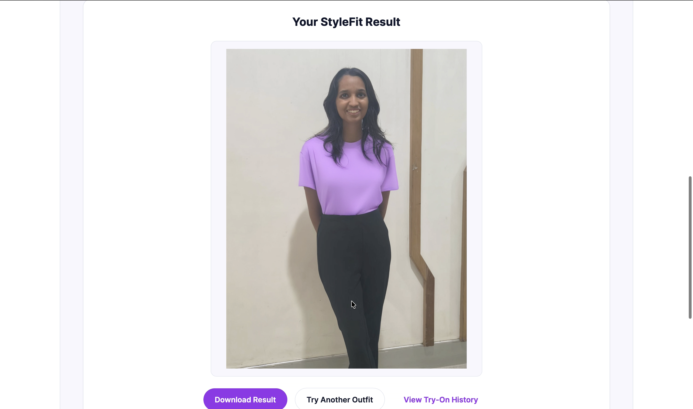

# StyleFit — AI Virtual Try-On

## Your look, perfectly visualized.

StyleFit is an AI-powered virtual try-on web application that allows users to visualize how a garment may look on them before purchasing or choosing an outfit.

The application combines a fashion shopping interface with an AI virtual try-on system. Users can browse clothing, select a garment, upload their image, and generate a virtual try-on result using the IDM-VTON (Improving Diffusion Models for Authentic Virtual Try-on in the Wild) model.

StyleFit also provides user authentication, product browsing, personalized try-on history, and a responsive web interface.

## 1. Overview

### Problem Statement

Online clothing shopping allows users to view product images, but it can be difficult to determine how a particular garment will look on an individual without physically trying it on.

Traditional online shopping therefore has limitations such as:

* Difficulty visualizing clothing on oneself.
* Uncertainty about appearance and fit.
* Repeated returns due to unsuitable choices.
* Limited personalization in conventional product browsing.

### Proposed Solution

StyleFit addresses this problem through an AI-based virtual try-on system.

The user can:

1. Create an account or log in.
2. Browse available clothing.
3. Select a garment.
4. Upload a person image.
5. Send the person and garment images to the IDM-VTON inference system.
6. Generate an AI-based virtual try-on image.
7. View the generated result.
8. Access previous results through Try-On History.

### Main Objective

The objective of StyleFit is to provide an interactive platform where users can visualize garments on themselves before making a clothing choice.


## 2. Application Screenshots

### 2.1 Home Page

The StyleFit home page introduces the application and provides navigation to the shopping and virtual try-on functionality.



### 2.2 User Registration

Users can create an account before accessing personalized functionality.


### 2.3 Login

Registered users can securely log in to the application.



### 2.4 Shop

The Shop page allows users to browse available clothing products. Users can select a garment from the available collection and use it with the StyleFit virtual try-on system.



Supported categories include:

* T-Shirts
* Shirts
* Tops
* Sweaters
* Jackets

### 2.5 StyleFit

Users upload their image and select the garment they want to visualize.




### 2.6 AI Generated Result

The generated virtual try-on result is displayed after the IDM-VTON inference process is completed.



### 2.7 Try-On History

Users can view their previously generated try-on results.


## 3. Tech Stack

### Frontend

* HTML5 - Application structure
* CSS3 - Styling
* Tailwind CSS - Responsive UI design
* JavaScript - Client-side interactions
* Thymeleaf - Dynamic server-side HTML rendering

### Backend

* Java 21 - Backend development
* Spring Boot 3.x - Application framework
* Spring MVC - Web request handling
* Spring Security - Authentication and authorization
* JWT - User authentication
* Spring Data MongoDB - Database access
* Maven - Dependency and project management

### Database

* MongoDB - User, product and try-on result storage

### Artificial Intelligence

* IDM-VTON - AI virtual try-on
* Hugging Face - Hosted model/inference service
* Gradio API - Communication with the hosted inference service


## 4. System Architecture

The overall architecture of StyleFit consists of the browser-based frontend, Spring Boot backend, MongoDB database, and external AI inference service.

                         ┌──────────────────────┐
                         │      USER / BROWSER  │
                         │                      │
                         │ HTML + Tailwind CSS  │
                         │     Thymeleaf        │
                         └──────────┬───────────┘
                                    │
                                    │ HTTP Request
                                    ▼
                    ┌───────────────────────────────┐
                    │         SPRING BOOT           │
                    │                               │
                    │ Controllers                   │
                    │ Services                      │
                    │ Spring Security               │
                    │ JWT Authentication            │
                    └───────────────┬───────────────┘
                                    │
                    ┌───────────────┴────────────────┐
                    │                                │
                    ▼                                ▼
          ┌──────────────────┐             ┌─────────────────────┐
          │     MongoDB      │             │   HUGGING FACE      │
          │                  │             │                     │
          │ Users            │             │     IDM-VTON        │
          │ Products         │             │                     │
          │ Try-On Results   │             │ AI Inference        │
          └──────────────────┘             └──────────┬──────────┘
                                                      │
                                                      │
                                                      ▼
                                           ┌─────────────────────┐
                                           │ Generated Try-On    │
                                           │       Image         │
                                           └──────────┬──────────┘
                                                      │
                                                      ▼
                                           ┌─────────────────────┐
                                           │   Result / History  │
                                           └─────────────────────┘


## 5. Application Architecture

StyleFit follows a **layered Spring Boot architecture** that separates the presentation layer, business logic, database operations, security, and AI integration.

This structure makes the application modular, maintainable, and easier to extend.

### 📁 Project Structure

```text
src/main/java/com/virtualfit/ai/
│
├── config/
│   └── Application configuration
│
├── controller/
│   ├── AuthController
│   ├── HomeController
│   ├── ProfileController
│   ├── ShopController
│   └── StyleFitController
│
├── dto/
│   └── Data Transfer Objects
│
├── exception/
│   └── Custom exception handling
│
├── model/
│   ├── User
│   ├── Product
│   └── TryOnResult
│
├── repository/
│   ├── UserRepository
│   ├── ProductRepository
│   └── TryOnResultRepository
│
├── security/
│   ├── SecurityConfig
│   ├── JwtService
│   ├── JwtAuthenticationFilter
│   └── CustomUserDetailsService
│
└── service/
    ├── AuthService
    ├── ProductService
    ├── StyleFitService
    └── HuggingFaceService
```

### Controllers

Handle web requests and application navigation.

Examples:
* AuthController
* HomeController
* ProfileController
* ShopController
* StyleFitController

### Services

Contain the main application logic.

Examples:
* AuthService
* ProductService
* StyleFitService
* HuggingFaceService

### Repositories

Handle MongoDB operations.

* UserRepository
* ProductRepository
* TryOnResultRepository

### Security

Authentication is handled using Spring Security and JWT.

* SecurityConfig
* JwtService
* JwtAuthenticationFilter
* CustomUserDetailsService

## 6. Sample Output

The system requires two main visual inputs:
1. Person Image
2. Garment Image


The system gives below output


## 7. Working of the Application

The StyleFit application follows a sequential workflow from user authentication to clothing selection, image processing, AI-based virtual try-on, and result storage.

### Step 1 — User Registration

The user creates an account by providing the required registration details.

```text
User
  │
  ▼
Registration Form
  │
  ▼
AuthController
  │
  ▼
AuthService
  │
  ▼
UserRepository
  │
  ▼
MongoDB
```

The user's registration information is validated and stored in MongoDB.

---

### Step 2 — User Login

The user enters their registered credentials to log in.

After successful authentication, a **JWT token** is generated and used to authenticate subsequent protected requests.

```text
User
  │
  ▼
Login Form
  │
  ▼
AuthController
  │
  ▼
AuthService
  │
  ▼
Authentication
  │
  ▼
JWT Token
  │
  ▼
Spring Security
  │
  ▼
Authenticated User
```

---

### Step 3 — Browse Clothing

The authenticated user opens the **Shop** page to browse available clothing products.

Product information is retrieved from MongoDB through the repository and service layers and displayed using Thymeleaf.

```text
MongoDB
    │
    ▼
ProductRepository
    │
    ▼
ProductService
    │
    ▼
ShopController
    │
    ▼
Thymeleaf Shop Page
```

The user can browse supported categories such as **T-Shirts, Shirts, Tops, Jackets, and Sweaters**.

---

### Step 4 — Select Garment

The user selects a garment from the available products.

The selected garment's image and information are passed to the **StyleFit virtual try-on interface**.

```text
Shop Page
    │
    ▼
Select Garment
    │
    ▼
Garment Image
    │
    ▼
StyleFit Try-On Interface
```

---

### Step 5 — Upload Person Image

The user uploads an image that will be used for the virtual try-on process.

The uploaded person image is combined with the selected garment image.

```text
Person Image
      │
      ├──────────────┐
      │              │
      ▼              ▼
Person Image    Garment Image
      │              │
      └───────┬──────┘
              ▼
      StyleFit Backend
```

The images are then sent to the virtual try-on processing pipeline.

---

### Step 6 — Virtual Try-On Processing

The `StyleFitController` receives the try-on request and passes it to `StyleFitService`.

`StyleFitService` coordinates the process and communicates with `HuggingFaceService`.

```text
StyleFitController
        │
        ▼
StyleFitService
        │
        ▼
HuggingFaceService
        │
        ▼
Hugging Face IDM-VTON
        │
        ▼
AI Virtual Try-On Processing
```

The IDM-VTON model processes the person image and garment image to generate a virtual try-on result.

---

### Step 7 — Generate Try-On Result

After the AI model completes the inference process, the generated image is returned to the StyleFit backend.

```text
IDM-VTON
    │
    ▼
Generated Try-On Image
    │
    ▼
HuggingFaceService
    │
    ▼
StyleFitService
    │
    ▼
StyleFitController
    │
    ▼
StyleFit Result Page
```

The generated image is displayed to the user on the StyleFit result page.

---

### Step 8 — Store Try-On History

The generated try-on result and relevant information are stored in MongoDB so that the authenticated user can access their previous try-on results.

```text
Generated Try-On Result
          │
          ▼
TryOnResultRepository
          │
          ▼
MongoDB
          │
          ▼
Try-On History
```

The history page displays the user's previously generated try-on results.

---

### Complete Application Workflow

```text
┌──────────────────────┐
│   User Registration  │
└──────────┬───────────┘
           ▼
┌──────────────────────┐
│     User Login       │
│      + JWT Auth      │
└──────────┬───────────┘
           ▼
┌──────────────────────┐
│    Browse Clothing   │
└──────────┬───────────┘
           ▼
┌──────────────────────┐
│    Select Garment    │
└──────────┬───────────┘
           ▼
┌──────────────────────┐
│ Upload Person Image  │
└──────────┬───────────┘
           ▼
┌──────────────────────┐
│   StyleFit Backend   │
└──────────┬───────────┘
           ▼
┌──────────────────────┐
│  Hugging Face        │
│      IDM-VTON        │
└──────────┬───────────┘
           ▼
┌──────────────────────┐
│ Generated Try-On     │
│       Result         │
└──────────┬───────────┘
           ▼
┌──────────────────────┐
│  MongoDB Try-On      │
│       History        │
└──────────────────────┘
```

## 8. Demo Walkthrough

The following sequence can be used for the project demonstration.

1. Open StyleFit

Start the application and open:

http://localhost:8080

Show the StyleFit landing page.

⸻

2. Register / Login

Demonstrate:

Register
   ↓
Login
   ↓
Authenticated User

⸻

3. Open Shop

Navigate to:

Shop

Demonstrate:

* Product categories.
* Product cards.
* Product images.
* Prices in ₹.
* Search.
* Category filtering.

⸻

4. Select a Garment

Select one of the available garments.

For example:

T-Shirt

Click:

Try with StyleFit

⸻

5. Upload Person Image

Upload a suitable person image.

For better results, use:

* Clear image.
* Person facing the camera.
* Good lighting.
* Upper body clearly visible.
* Minimal obstruction.

⸻

6. Generate Try-On

Click the try-on/generate button.

The backend sends the required information to the IDM-VTON inference service.

Person Image
      +
Garment Image
      ↓
Spring Boot
      ↓
Hugging Face
      ↓
IDM-VTON
      ↓
Generated Result

⸻

7. Display Result

The generated image is displayed on the result page.

Demonstrate the generated output compared with the original person image and garment.

⸻

8. Open Try-On History

Navigate to:

Try-On History

Show that the generated result has been stored and can be accessed later.


## 9. Reference Paper

### Primary Research Paper

**Title:**  
*Avatar Closet: An Augmented Reality Based Multi-Modal Virtual Try-On System for Fashion Retail*

**Authors:**

- Sushma Vittal
- Babitha Ganesh
- Guruprasad Bhat
- Sneha Shanbhag
- Swati Shet
- Vasudeva
- Aruna Kumari G K

**Conference:**  
2025 3rd International Conference on Recent Advances in Information Technology for Sustainable Development (ICRAIS)

**Publication Year:**  
2025

**DOI:**  
10.1109/ICRAIS66073.2025.11234687

### Paper

The reference paper is an IEEE conference paper available through IEEE Xplore.

The paper proposes a multi-modal Virtual Try-On system that integrates **Augmented Reality (AR), Artificial Intelligence (AI), Avatar technology, and Image Dressing** to improve the online fashion shopping experience. Avatar_Closet_An_Augmented_Reality_Based_Multi-Modal_Virtual_Try-On_System_for_Fashion_Retail.pdf

### Key Concepts from the Paper

The proposed **Avatar Closet** system provides three major virtual try-on modes:

1. **Avatar Mode**  
   Creates a personalized 3D avatar that allows users to visualize garments in a virtual environment.

2. **AR Mode**  
   Uses camera-based augmented reality to project clothing onto the user's live image.

3. **Image Dressing Mode**  
   Allows users to upload a personal photograph or model image and digitally apply selected garments. Avatar_Closet_An_Augmented_Reality_Based_Multi-Modal_Virtual_Try-On_System_for_Fashion_Retail.pdf

The paper also incorporates **Haar Cascade classifiers** for body and facial recognition and a **Gemini-based conversational assistant** for user guidance and outfit recommendations. Avatar_Closet_An_Augmented_Reality_Based_Multi-Modal_Virtual_Try-On_System_for_Fashion_Retail.pdf

### Methodology

The proposed architecture contains an **Avatar Closet**, which acts as a digital wardrobe containing clothing items, textures, and fitting information.

The Try-On module coordinates three components:

```text
                    ┌────────────────────┐
                    │    Avatar Closet   │
                    │   Digital Wardrobe │
                    └─────────┬──────────┘
                              │
                              ▼
                    ┌────────────────────┐
                    │      Try-On        │
                    │      Module        │
                    └─────────┬──────────┘
                              │
             ┌────────────────┼────────────────┐
             │                │                │
             ▼                ▼                ▼
      Image Dressing       AR Camera        Avatar
             │                │                │
             └────────────────┼────────────────┘
                              ▼
                    ┌────────────────────┐
                    │   Final Outcome    │
                    └────────────────────┘
```

The paper explains that the Image Dressing component uses a pre-trained machine learning model to overlay garments onto user/model images, while the AR and Avatar components provide real-time and 3D-based visualization respectively. Avatar_Closet_An_Augmented_Reality_Based_Multi-Modal_Virtual_Try-On_System_for_Fashion_Retail.pdf


### Citation

```text
S. V. Babitha Ganesh, G. Bhat, S. Shanbhag, S. Shet,
Vasudeva and A. Kumari G K, "Avatar Closet: An Augmented
Reality Based Multi-Modal Virtual Try-On System for Fashion
Retail," 2025 3rd International Conference on Recent Advances
in Information Technology for Sustainable Development (ICRAIS),
2025, DOI: 10.1109/ICRAIS66073.2025.11234687.
```


## 10. Student Details

* Name - Riya Pradeep Mokale 
* Roll No. - 5024137
* Department - Information Technology
* Institute - Fr. C Rodrigues Institute of Technology
* Academic Year - 2026–27
* Project Title - StyleFit — AI Virtual Try-On
* Domain - Artificial Intelligence
* Technology - Java, Spring Boot, Thymeleaf, MongoDB
* AI Model - IDM-VTON
